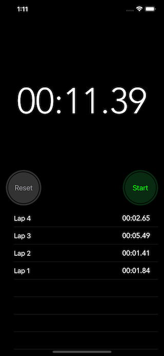

    <h1>Stopwatch</h1>
    <i>Stopwatch is a simple iOS app that measures the time interval of an event. It is based on Apple's stock stopwatch app (Clock).</i>

 

    Information
     
    
    

---

# Features
- Elapsed time
- Lap history

# Screenshot

# To-Do
- [ ] Best and worst laps
- [ ] Keep running timer in background

# Licence
Stopwatch is released under the MIT license. See [LICENSE](./LICENSE) for details.
